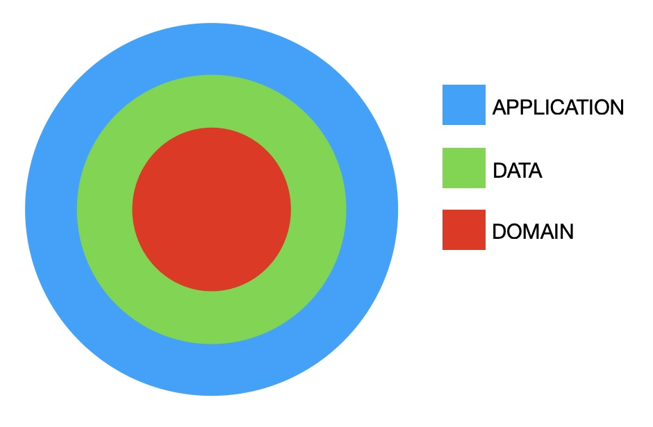
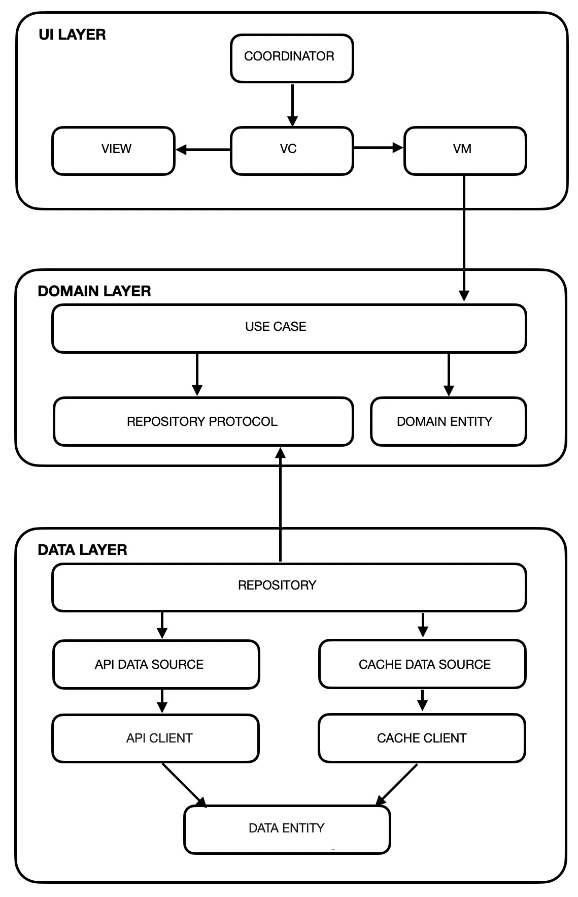

# Code Challenge Lead iOS Engineer

## INSTALLATION

The external dependencies (RxSwift, RxCocoa and RxBlocking) are managed using Swift Package Manager, so it will only be necessary to open the project with Xcode and it will manage the installation of the necessary packages, after which it can be executed without further steps.

## PROPOSED SOLUTION

**MVVM** + **Coordinator** + **Clean Architecture** have been applied using **RxSwift**.

Clean architecture structures the code in concentric layers with a dependency rule: nothing in an inner layer can know anything at all about something in an outer one.
Inner layers contain business logic and use cases, outer layers contain UI, frameworks, DB, etc.

Based on the previous premises, the implemented solution consists of 3 layers:

Let's see in a little more detail:

### UI layer

The view is fed with view models that are placed between the view controllers and the use cases. These execute business logic of the former and updating with the response to the latter and managing user interaction.

View controllers only talk to view models. View models expose input and output observables to allow the interaction with view models and coordinators but without knowing any of them. The coordinators are responsible for the navigation and the entire connection mechanism between scenes, for which they make use of a dependency container based on factory methods.

### Domain layer

This is a business layer where the business logic is broken down into minor and reusable functionality blocks: use cases. 

This layer knows nothing about other layers. Data repositories are used to request data, process it and return a response. The data repositories are defined as protocols (interfaces) in this layer
There are domain layer entities.

### Data layer

Here lives the implementation of the repositories defined in the domain layer.
The repository pattern is used to abstract where the data comes from.
Repositories use one or more data sources, include the logic to combine the information obtained and return it to the use cases that requested it.
Data layer has its own data entities depending on the data source platform.

Here’s the scheme of the architecture:

## Implementation details

This section lists all those noteworthy implementation details, assumptions made during development, and comments.

For the sake of simplicity some concessions and assumptions have been made such as:

 - Since there are hardly any localizable elements, no localization has been included.
 
 - Minimal error management is done, displaying them as a UIAlertController without localization.
 - To avoid complexity in data parsing, it has been assumed that the network response is always complete and without null values.
 - Although in other circumstances view entities would have been created, in this case domain entities are used in the view layer due to the simplicity of the model.
 - Data and Domain are just logical groups within the project, but could have been created as packages to facilitate distribution and reuse.
 - No se ha cubierto con tests toda la implementación. Sólo se incluyen algunos como ejemplo.
 - The UI tests have simply been outlined. The environment has been configured, allowing detecting the execution of tests and being able to exchange the dependency container for an alternative one prepared for them.
 - I have avoided the inclusion of external libraries for networking, cache and dependency injection, opting for my own simpler implementations and adapted to the specific case.
 - The API response includes for all users the same url as the background image, which gives a random image. To avoid that once a user has been drawn their background image changes, a simple cache has been implemented that indexes them by associating the image with each user (url + id).

